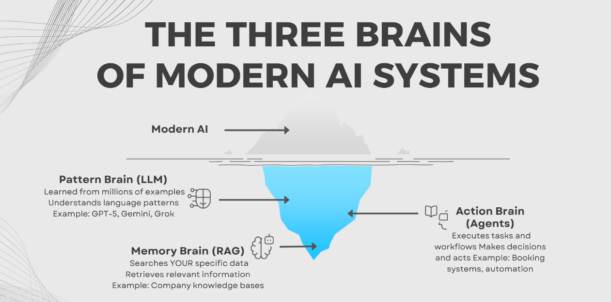

# Beyond ChatGPT
## How Intelligent Software Systems Think and Work

<p align="left">
  
</p>

This repository contains the presentation I delivered as a **Guest Lecturer** at my alma mater:

**Dnyanprasarak Mandal's College and Research Centre (Affiliated with Goa University)**

The talk focuses on how modern AI systems actually work behind the scenes — moving beyond the idea of **ChatGPT as a magic tool** and explaining the architecture engineers build in real-world systems.

---

# 📑 Presentation

The full slides from the guest lecture are available here:

👉 **[Beyond ChatGPT – AI Systems Architecture](./Beyond-ChatGPT.pdf)**

---

# Presentation Overview

Most people interact with AI through tools like ChatGPT.

But modern AI systems are **not just a single model** — they are composed systems with multiple layers working together.

This talk introduces the **Three-Brain Architecture of Modern AI Systems.**

---

# 🧠 Pattern Brain — LLMs

Large Language Models like **GPT, Gemini, and others** are massive pattern recognition engines trained on huge datasets.

They:

- Predict the next word based on probability
- Generate text token by token
- Do not actually *know* facts
- Can produce confident but incorrect responses (**hallucinations**)

---

# 📚 Memory Brain — RAG (Retrieval Augmented Generation)

LLMs alone do **not have access to private or real-time data.**

RAG solves this by:

1. Converting documents into **vector embeddings**
2. Storing them in a **vector database**
3. Retrieving relevant information at query time
4. Injecting that information into the prompt

This allows AI systems to answer using **company data, knowledge bases, and documents**.

---

# 🛠️ Action Brain — Agents

Agents move AI from **answering questions → executing tasks.**

Examples:

- Searching APIs
- Performing automation
- Running workflows
- Making decisions across systems

Example workflow:

```

User request → Agent planning → API calls → Task execution → Response

```

---

# Multi-Agent Systems

Instead of one large agent, modern systems often use **multiple specialized agents.**

Example orchestration:

- **Coordinator Agent** → plans tasks
- **Research Agent** → gathers data
- **Content Agent** → generates output
- **Execution Agent** → performs actions

Specialized agents are **more scalable and reliable.**

---

# Guardrails and Safety

Powerful AI systems require safety mechanisms:

- Hard limits (API calls, cost caps)
- Permission control
- Human approval for critical actions
- Monitoring and rollback systems

Responsible AI engineering is not just about **capability — it is about control and reliability.**

---

# Key Message for Students

In **2022**, using AI tools was impressive.

In **2026**, the real demand is for engineers who can **design and build AI systems.**

<p align="left">
  
</p>


The future roles include:

- AI Engineers
- RAG System Builders
- AI Infrastructure Engineers
- Agentic Workflow Developers

---

# Author

**Sahil Makandar**  
Microsoft Certified AI Engineer

LinkedIn  
https://www.linkedin.com/in/mahaboobsab-makandar/

Email  
mahaboobsabgoa@gmail.com

---

# License

This project is licensed under the **MIT License**.

It takes **2 lines in README but looks very impressive**. If you want, I can show you that next. 🚀
